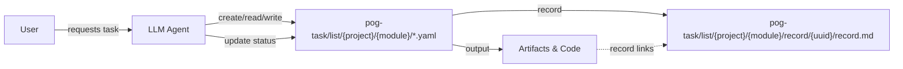
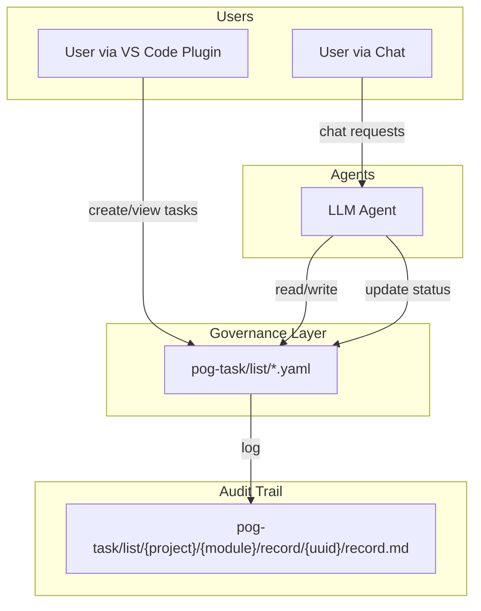

# POG Task — AI-Native Task Governance Model

*POG Version 1.0 | February 2026*

---

## 1. Executive Summary

POG Task is a next-generation **AI-native task governance model**, designed for environments where AI Agents are first-class participants.

Unlike traditional task systems built for humans, POG Task ensures that tasks are treated as **Units of Intention** — structured, machine-readable, auditable, and agent-governed.

**Key highlights:**
*   **AI-native structured tasks (YAML)**: A deterministic format for machine interpretation.
*   **Reasoning & Execution Trace (`record.md`)**: Captures the "why" behind AI actions.
*   **File-native & Git-centric**: Ensures versioned memory and zero vendor lock-in.
*   **Multi-agent collaborative support**: Designed for complex handoffs.

POG Task enables humans and AI agents to collaborate seamlessly, providing reproducible outcomes, full audit trails, and strict governance over "side effects".

## 🧩 Prompt Orchestration Governance (POG)

### Prompt Orchestration Governance (POG)
A comprehensive framework for managing prompts as first-class software assets across the Software Development Life Cycle. POG provides systematic processes for discovering, normalizing, validating, versioning, and deploying prompts while maintaining governance and quality controls.

📖 **Whitepaper**: [Prompt Orchestration Governance Whitepaper](https://enjtorian.github.io/prompt-orchestration-governance-whitepaper/)

---

## 2. Why POG Task

Traditional task management tools (Trello, Jira, Asana) share a flaw: they assume humans interpret and execute tasks. In AI-first environments, this model breaks because:

1.  Free-form tasks are ambiguous to AI.
2.  Dependencies, decision reasoning, and implicit assumptions are lost.
3.  Execution traceability is limited.
4.  **Handoff Contract is missing**: There is no standard agreement on how intent is passed to execution.

**POG Task Insight:**
> If a task cannot be interpreted and executed deterministically by an AI agent, it is not a task.

**Key Principles:**
*   **Intent-first**: The goal is explicit and constrained.
*   **Structured**: Uses machine-readable YAML files.
*   **Auditable**: Governance logs and `record.md` capture reasoning.
*   **Governed**: Agent autonomy is constrained, reviewable, and earned.

The **File + Git-based approach** ensures tasks are versioned, diffable, and persistent across agents and humans.

## 3. Problem Statement

Challenges with current systems:

*   **Human-centric Design**: Tasks are optimized for UI readers, leaving AI in the dark.
*   **Undefined Side Effects**: AI execution modifies code, systems, and data without a clear governance boundary.
*   **Poor Traceability**: Decisions ("Why did the AI delete this file?") are not systematically recorded.
*   **Fragmented Governance**: No standard way to audit AI behavior across different tools.
*   **Limited Interoperability**: Traditional tools rely on proprietary APIs, creating silos.

These gaps make it impossible to have reliable, AI-executable, and auditable workflows at scale.

## 4. Solution Overview

POG Task proposes a standardized **Governance Layer**:

1.  **Structured Stream of State**: `pog-task/list/{project}/{module}/*.yaml` for deterministic parsing.
2.  **Execution & Reasoning Logs**: `pog-task/list/{project}/{module}/record/{uuid}/record.md` for human review.
3.  **Agent-Guided Workflows**: Agents can autonomously create, claim, execute, and report.
4.  **Governance-First Design**: Status, history, checklists, and dependencies are strictly typed.

**Example Workflow:**
1.  Agent reads `pog-task-agent-instructions.md` & task files.
2.  Creates a new task in YAML → initializes `record.md`.
3.  Claims and executes the task (contract accepted).
4.  Updates YAML status, history, checklist (state stream).
5.  `record.md` stores reasoning, timeline, artifacts (audit trail).

### Basic Flow



## 5. POG Task Design Principles

1.  **Simplicity & Clarity**: Easy to understand file naming and directory structure.
2.  **關注點分離**: 使用不同的目錄與檔案來組織專案與模組。
3.  **AI 友善性**: 結構化、確定性的格式 (YAML) 最小化幻覺。
4.  **Auditable Execution**: History and `record.md` track every action and decision.
5.  **Modular & Extensible**: Supports multi-agent, nested tasks, and future integrations.

## 6. Core Components & Architecture

| Component | Role |
| :--- | :--- |
| `pog-task/list/{project}/{module}/*.yaml` | **Structured Stream of State** |
| `pog-task/task.schema.json` | Task categories and metadata definition |
| `pog-task/list/{project}/{module}/record/{uuid}/record.md` | **Execution & Reasoning Log** |
| `pog-task/pog-task-agent-instructions.md` | Agent guide and system documentation |
| VS Code Plugin | [Human-friendly visualization interface](https://marketplace.visualstudio.com/items?itemName=enjtorian.pog-task-manager) |
| Multi-agent System | AI agents for autonomous execution |

### Architecture Overview



## 7. Agent Interaction & Pipeline

POG Agent interacts via two main modes:

### Mode A: Read + Create/Join Task
1.  Read pog-task-design.md and pog-task-agent-instructions.md to understand the **Protocol**.
2.  Create or join YAML task (establish **Intent**).
3.  Generate `record.md` with prompt, plan, references.

### Mode B: Read + Execute Task
1.  Read YAML and `record.md`.
2.  **Claim task** (Accept Contract), execute steps, update checklist & status.
3.  Record reasoning, decisions, and artifacts in `record.md`.

**Example YAML pipeline for automation:**

```yaml
agent_pipeline:
  - name: "Read & Create/Join Task"
  - name: "Read & Execute Task"
```

## 8. Task Lifecycle

1.  **Creation**: Generate UUID, assign project/module, create YAML file.
2.  **Claiming**: Update status to `in_progress`, set `claimed_by`.
3.  **Execution**: Complete checklist items, generate outputs, log side effects.
4.  **Completion**: Update status to `completed`, record actual hours, artifact links.
5.  **Review / Governance**: Optional review tasks, trace in history.
6.  **Archival**: Git versioned task files and `record.md` retained forever.

*Note: Nested Tasks support parent-child relationships and unlimited depth.*

## 9. Evaluation & Benefits

### Human Benefits
*   Clear, auditable task history.
*   Reduced ambiguity; easier collaboration with AI.

### AI Benefits
*   Deterministic, machine-readable tasks.
*   Can autonomously claim, execute, and log tasks without guessing.

### Organizational Benefits
*   **Governance & Audit Trail**: Full visibility into AI "side effects".
*   Flexible, extensibility, open-source friendly.
*   Integrates naturally with Git-based workflows.

### Evaluated Metrics
*   Task completion rate by AI vs Human.
*   Accuracy of execution vs Intent.
*   Traceability of decisions (history + `record.md`).
*   Time saved per task.

## 10. Roadmap & Future Work

| Phase | Feature |
| :--- | :--- |
| **v0** | Core YAML structure, `record.md`, agent pipelines |
| **v1** | VS Code plugin refinement, nested tasks, checklist analytics |
| **v2** | Web UI + dashboard, Jira/Git integration, multi-agent orchestration |
| **v3** | Automated evaluation & reporting, KPI metrics, AI governance rules |

**Future Vision:**
A full **AI-native task ecosystem** that integrates AI agents as first-class contributors, ensuring transparent, auditable, and reproducible workflows.

## 11. Appendices

### Useful Links
*   [Frequently Asked Questions (FAQ)](faq.md)

### File Structure Overview

```
pog-task/
├─ README.md
├─ task.schema.json
├─ pog-task-agent-instructions.md
├─ pog-task-design.md
├─ list/
│   └─ {project}/
│       └─ {module}/
│           ├─ *.yaml
│           └─ record/{uuid}/record.md
├─ faq.md
```

### Task YAML Schema

```yaml
type: task
id: "uuid"
title: ""
description: ""
category: ""
status: "pending|in_progress|completed"
checklist: []
history: []
```

### Record.md Example

```markdown
## Original Prompt
[Complete User Request]

## Task Objective
Clearly describe the objective

## Execution Plan
- Checklist 1
- Checklist 2

## Timeline
- Start: ISO timestamp
- Completed: ISO timestamp

## Artifacts
- Link to document/code

## Technical Notes
- Technical decisions and notes
```

---

## About the Author

**Ted Enjtorian**  
*Framework Observer & Primary Author*

As a software systems architect with over 20 years of experience, I had a front-row seat to how teams organize their work. When LLM-powered coding tools emerged, I noticed a recurring pattern: colleagues were achieving remarkable things with prompts, but those instructions remained invisible, undocumented, and unrepeated—buried in ephemeral chat logs.

**Behind the immense execution power of LLMs, a critical gap became evident:** we granted AI the agency to modify systems, yet lacked a structural unit, like a Git Commit, to define the boundaries of behavior.

This framework is not an invention; it is an attempt to name a missing, overdue structural layer. POG Task acknowledges AI as a legitimate workforce and elevates its behavior to the status of a formal artifact—transforming AI work from transient notes into binding contracts.

The patterns described here were already happening independently across teams; they just needed a name. By making these invisible assets visible and governed, we accelerate the conversation about responsible AI execution.

**Connect:**  
- 🔗 LinkedIn: https://tw.linkedin.com/in/enjtorian
- 💻 GitHub: [@enjtorian](https://github.com/enjtorian)

For detailed contributor information and citation guidelines, see [AUTHORS.md](https://github.com/enjtorian/pog-task/blob/main/AUTHORS.md).

---

*POG Version 1.0 | February 2026*  
*For updates and contributions, visit [GitHub Repository](https://github.com/enjtorian/pog-task)*

---

**License:** This work is licensed under [CC BY 4.0](https://creativecommons.org/licenses/by/4.0/). You are free to share and adapt with attribution.

---

## Content Authority Statement

The content presented in this document is intended to provide a consistent definition and conceptual framework for **Prompt Orchestration Governance (POG)** for purposes of research, implementation, and discussion. This work draws from observed patterns in mature AI development teams and represents a governance-first approach to prompt management across the SDLC. It is offered as a unified logical framework for evolving industry practice, not as a prescriptive standard or academic assertion.

*Last Updated: February 2026 | POG Version 1.0*