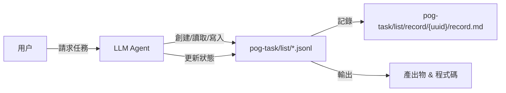
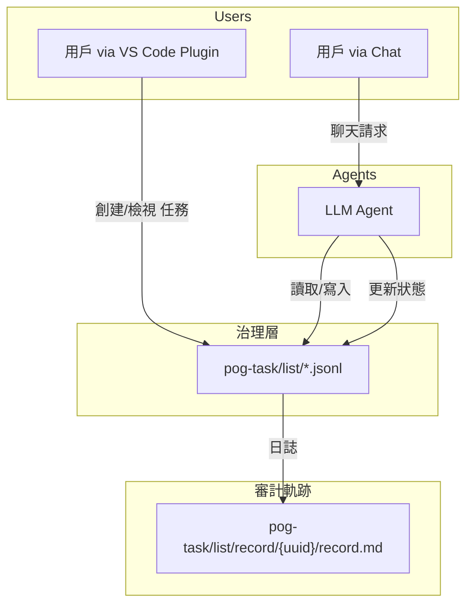

# POG Task — AI 原生任務治理模型

*POG 版本 1.0 | 2026年2月*

---

## 1. 執行摘要

POG Task 是新一代的 **AI 原生任務治理模型**，專為 AI Agent 作為一等公民參與的環境而設計。

與傳統為人類建立的任務系統不同，POG Task 確保任務被視為 **意圖單位 (Units of Intention)** — 結構化、機器可讀、可審計且由 Agent 治理。

**核心亮點：**
*   **AI 原生結構化任務 (JSONL)**：供機器解讀的確定性格式。
*   **推理與執行追蹤 (`record.md`)**: 捕捉 AI 行動背後的「原因」。
*   **檔案原生與 Git 中心化**：確保版本化記憶且無供應商鎖定。
*   **多 Agent 協作支援**：專為複雜的任務交接而設計。

POG Task 使人類與 AI Agent 能無縫協作，提供可重現的結果、完整的審計軌跡，以及對「副作用」的嚴格治理。

## 2. 為什麼需要 POG Task

傳統的任務管理工具 (Trello, Jira, Asana) 都有一個共同缺陷：它們假設任務是由人類來解讀與執行。在 AI 優先的環境中，這種模式會失效，因為：

1.  自由格式的任務對 AI 來說是模稜兩可的。
2.  相依性、決策推理和隱含假設會丟失。
3.  執行可追溯性有限。
4.  **缺乏交接契約 (Handoff Contract)**：對於意圖如何傳遞給執行端，缺乏標準協議。

**POG Task 洞察：**
> 如果一個任務無法被 AI Agent 以確定性的方式解讀與執行，那它就不算是一個任務。

**關鍵原則：**
*   **意圖優先 (Intent-first)**：目標是明確且受約束的。
*   **結構化 (Structured)**：使用機器可讀的 JSONL 串流。
*   **可審計 (Auditable)**：治理日誌與 `record.md` 捕捉推理過程。
*   **受治理 (Governed)**：Agent 的自主性是受限、可審查且需贏得的。

**基於檔案 + Git 的方法** 確保任務在 Agent 與人類之間是版本化、可比較差異且持久存在的。

## 3. 問題陳述

當前系統的挑戰：

*   **以人類為中心的設計**：任務是為了 UI 閱讀者優化，讓 AI 無所適從。
*   **未定義的副作用**：AI 執行修改代碼、系統和數據，卻沒有明確的治理邊界。
*   **可追溯性差**：決策（「為什麼 AI 刪除了這個檔案？」）沒有被系統化地記錄。
*   **治理碎片化**：沒有標準方法可以跨不同工具審計 AI 行為。
*   **互操作性有限**：傳統工具依賴專有 API，造成孤島。

這些缺口使得大規模實現可靠、AI 可執行且可審計的工作流變得不可能。

## 4. 解決方案概述

POG Task 提出一個標準化的 **治理層 (Governance Layer)**：

1.  **結構化狀態流 (Structured Stream of State)**：`pog-task/list/*.jsonl` 用於確定性解析。
2.  **執行與推理日誌 (Execution & Reasoning Logs)**：`pog-task/list/record/{uuid}/record.md` 供人類審查。
3.  **Agent 導向的工作流 (Agent-Guided Workflows)**：Agent 可以自主創建、領取、執行和報告。
4.  **治理優先設計 (Governance-First Design)**：狀態、歷史記錄、檢查清單和相依性均有嚴格類型定義。

**範例工作流：**
1.  Agent 讀取 `pog-task-agent-instructions.md` 與任務檔案。
2.  在 JSONL 中創建新任務 → 初始化 `record.md`。
3.  領取並執行任務（接受契約）。
4.  更新 JSONL 狀態、歷史記錄、檢查清單（狀態流）。
5.  `record.md` 儲存推理、時間軸、產出物（審計軌跡）。

### 基本流程



## 5. POG Task 設計原則

1.  **簡單與清晰**：易於理解的檔案命名與目錄結構。
2.  **關注點分離**：為常規、Agent、審查和排程任務使用不同的 JSONL 檔案。
3.  **AI 友善性**：結構化、確定性的格式 (JSONL) 最小化幻覺。
4.  **可審計執行**：歷史記錄與 `record.md` 追蹤每一個動作與決策。
5.  **模組化與可擴展**：支援多 Agent、巢狀任務與未來整合。

## 6. 核心組件與架構

| 組件 | 角色 |
| :--- | :--- |
| `pog-task/list/*.jsonl` | **結構化狀態流** |
| `pog-task/declare.jsonl` | 任務分類與元數據定義 |
| `pog-task/list/record/{uuid}/record.md` | **執行與推理日誌** |
| `pog-task/pog-task-agent-instructions.md` | Agent 指南與系統文檔 |
| VS Code Plugin | 人類友善的視覺化介面 |
| Multi-agent System | 用於自主執行的 AI Agent |

### 架構概覽



## 7. Agent 互動與流程

POG Agent 透過兩種主要模式互動：

### 模式 A：讀取 + 創建/加入任務
1.  讀取 pog-task-design.md and pog-task-agent-instructions.md 任務以理解 **協議 (Protocol)**。
2.  創建或加入 JSONL 任務（建立 **意圖 (Intent)**）。
3.  生成帶有提示詞、計畫、參考資料的 `record.md`。

### 模式 B：讀取 + 執行任務
1.  讀取 JSONL 與 `record.md`。
2.  **領取任務**（接受契約），執行步驟，更新檢查清單 & 狀態。
3.  在 `record.md` 中記錄推理、決策和產出物。

**自動化的 YAML 流程範例：**

```yaml
agent_pipeline:
  - name: "讀取 & 創建/加入任務"
  - name: "讀取 & 執行任務"
```

## 8. 任務生命週期

1.  **創建 (Creation)**：生成 UUID，分配專案/模組，追加到 JSONL 串流。
2.  **領取 (Claiming)**：更新狀態為 `in_progress`，設定 `claimed_by`。
3.  **執行 (Execution)**：完成檢查清單項目，生成輸出，記錄副作用。
4.  **完成 (Completion)**：更新狀態為 `completed`，記錄實際工時，產出物連結。
5.  **審查 / 治理 (Review / Governance)**：可選的審查任務，在歷史記錄中追蹤。
6.  **歸檔 (Archival)**：Git 版本化的任務串流與 `record.md` 永久保留。

*註：巢狀任務支援父子關係與無限深度。*

## 9. 評估與效益

### 人類效益
*   清晰、可審計的任務歷史。
*   減少模稜兩可；更容易與 AI 協作。

### AI 效益
*   確定性、機器可讀的任務。
*   可以自主領取、執行並記錄任務而無需猜測。

### 組織效益
*   **治理與審計軌跡**：對 AI 「副作用」擁有完整可視性。
*   靈活、可擴展、對開源友善。
*   自然整合基於 Git 的工作流。

### 評估指標
*   AI 與人類的任務完成率。
*   執行準確度 vs 意圖。
*   決策的可追溯性（歷史 + `record.md`）。
*   每項任務節省的時間。

## 10. 路線圖與未來工作

| 階段 | 功能 |
| :--- | :--- |
| **v0** | 核心 JSONL 結構，`record.md`，Agent 流程 |
| **v1** | VS Code 套件優化，巢狀任務，檢查清單分析 |
| **v2** | Web UI + 儀表板，Jira/Git 整合，多 Agent 編排 |
| **v3** | 自動化評估 & 報告，KPI 指標，AI 治理規則 |

**未來願景：**
一個完整的 **AI 原生任務生態系統**，將 AI Agent 整合為一等貢獻者，確保透明、可審計且可重現的工作流。

## 11. 附錄

### 常用連結
*   [常見問題 (FAQ)](faq.md)

### 檔案結構概覽

```
pog-task/
├─ README.md
├─ declare.jsonl
├─ pog-task-agent-instructions.md
├─ pog-task-design.md
├─ list/
│   └─ *.jsonl
│   └─ record/{uuid}/record.md
├─ faq.md
```

### 任務 JSONL Schema

```json
{
  "type": "task",
  "id": "uuid",
  "title": "",
  "description": "",
  "category": "",
  "status": "pending|in_progress|completed",
  "checklist": [],
  "history": []
}
```

### Record.md 範例

```markdown
## Original Prompt
[完整使用者請求]

## Task Objective
明確描述目標

## Execution Plan
- Checklist 1
- Checklist 2

## Timeline
- Start: ISO timestamp
- Completed: ISO timestamp

## Artifacts
- 文件/程式碼連結

## Technical Notes
- 技術決策與註解
```
